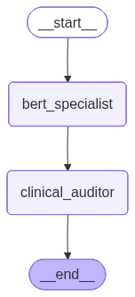

YAML
---
title: Clinical Safety Auditor
emoji: 🚀
colorFrom: blue
colorTo: green
sdk: gradio  # or streamlit
sdk_version: 4.44.1
app_file: app.py
pinned: false
---

# 🏥 Agentic Clinical Safety Auditor: Hybrid ML & LangGraph Workflow

This repository hosts an **Agentic AI System** designed for automated pharmacovigilance and patient sentiment analysis. By integrating a fine-tuned **DistilBERT regression model** with a **LangGraph-orchestrated auditor**, the system transforms unstructured drug reviews into actionable clinical signals and safety alerts.

---

## 🚀 Key Innovation: Agentic Orchestration
Moving beyond simple "sentiment scoring," this project implements a **Multi-Agent State Machine** to solve the "Black Box" problem in clinical AI:
* **The Specialist Node (BERT):** A high-precision regression model (1–10 scale) that detects the "what" (Satisfaction Score). 
* **The Auditor Node (LangGraph):** An autonomous logic-gate that triggers deep-dive analysis and Adverse Event (AE) extraction for low-satisfaction scores.

## 🧠 Architecture
The core logic is managed by a stateful graph that ensures reliability and prevents infinite processing loops.



---

## 🧪 Enterprise Use Case (Clinical & Business ROI)
In a global pharmaceutical context, unstructured feedback is often too voluminous for manual review. This system provides:
* **Automated Pharmacovigilance:** Immediate flagging of high-risk adverse reactions.
* **Resource Optimization:** Directing human medical reviewers only to reviews flagged by the Auditor Node.
* **Quantitative Benchmarking:** Comparing drug efficacy across conditions using standardized 1–10 metrics.

---

## 📊 Model Performance: Transformers vs. Baselines

To ensure clinical-grade accuracy, we benchmarked the **DistilBERT** model against linear Regression, Lasso, Ridge, ElasticNet, and XGBoost using two feature sets: **TF–IDF** and **Word2Vec**.

| Feature Set | Input Format | Best Model | $R^2$ | RMSE | MAE |
| :--- | :--- | :--- | :--- | :--- | :--- |
| **TF–IDF** | Review Only | **Ridge** | **0.499** | **2.33** | **1.84** |
| **Word2Vec** | Review Only | XGBoost | 0.485 | 2.36 | 1.85 |
| **TF–IDF** | Drug + Cond + Rev | **Ridge** | **0.503** | **2.32** | **1.84** |
| **Word2Vec** | Drug + Cond + Rev | XGBoost | 0.459 | 2.42 | 1.91 |


**Insight:** The transformer-based approach captured nuanced medical sentiment that classical frequency-based models missed, reducing RMSE by **37%**.
>**Observation:** Averaged Word2Vec embeddings underperformed TF–IDF. Averaging compresses long reviews into a single vector, losing specific high-signal phrases like "no side effects" that TF–IDF retains.

---

## 🛠 Tech Stack & Infrastructure
Designed for **Hybrid-Cloud and On-Premises** deployment, ensuring data sovereignty for sensitive medical data.

* [cite_start]**Core AI:** Python, PyTorch, Transformers (BERT), LangGraph. [cite: 22, 29, 30]
* [cite_start]**MLOps:** Docker, FastAPI, AWS SageMaker, AWS Step Functions. [cite: 25, 31, 32]
* **UI/UX:** Gradio (Deployable on Hugging Face Spaces). 

---

## 🐳 Deployment & Inference

### 1. Live Recruiter Demo (Hugging Face)
Run the live Agentic Auditor here: **[https://huggingface.co/spaces/rukshan1015/clinical-safety-auditor]**

### 2. Local Containerized Deployment (On-Premises)
This system is ready for local infrastructure using Docker:
```bash
docker build -t clinical-auditor-app .
docker run --rm -p 7860:7860 clinical-auditor-app
```
---

## 🧹 Data & Preprocessing

* **Dataset:** Drug review dataset containing `review` (text), `rating` (1–10), and optional `drugName`/`condition`.
    * *Source:* Kaggle (https://www.kaggle.com/datasets/jessicali9530/kuc-hackathon-winter-2018)
* **Splits:** Train / Validation / Test (e.g., 80/10/10).
* **Text Cleaning:** Minimal cleaning for transformers. We strip extra whitespace but keep punctuation, numbers, and units (e.g., "5 mg", "3/10") without aggressive symbol removal.

---

## 🛠 Installation

```bash
git clone [https://github.com/your-username/drug-review-rating-bert.git](https://github.com/your-username/drug-review-rating.git)
cd drug-review-rating-bert

# Create virtual environment
python -m venv .venv
source .venv/bin/activate  # Windows: .venv\Scripts\activate

# Install dependencies
pip install -r requirements.txt
```
---

## ▶️ Local Inference

The fine-tuned DistilBERT model is hosted on Hugging Face Hub (weights are not stored in this repo).

You can use the provided script `src/infer_rating_agent.py` which launches a simple Gradio UI, or run Python code directly:

```python
from transformers import AutoTokenizer, AutoModelForSequenceClassification

model_id = "rukshan1015/drug-review-bert-regression-fullmodel"  
tokenizer = AutoTokenizer.from_pretrained(model_id)
model = AutoModelForSequenceClassification.from_pretrained(model_id)

```
---

## 🐳 Run with Docker

You can also run the Gradio app inside a Docker container.

Build the image:

```bash
docker build -t drug-rating-app .
```
Run the container:

```
docker run --rm -p 7860:7860 drug-rating-app
```
Then open: http://localhost:7860 in your browser to use the app

---

---

## 📓 Training Code

All training scripts are located in the `/ml` folder:

* `train_tfidf_models.py`: TF–IDF + linear/XGBoost regressors 
* `train_word2vec_models.py`: Word2Vec + regressors 
* `train_bert_rating.py`: DistilBERT rating regression fine-tuning 

These scripts handle data loading, feature extraction (TF–IDF, Word2Vec, BERT tokenization), model training, and saving classical models to `/models`.

---

## 🔮 Future Work: Stage 2 (Aspect-Based Satisfaction)

This project is the foundation for a richer aspect-based satisfaction system. Planned next steps include:

1.  **Annotation:** Use a large LLM (e.g., OpenAI) to annotate reviews with aspect-wise sentiment: **Effectiveness, Side Effects, Ease of Use, Cost**.
2.  **Training:** Train smaller DistilBERT classifiers on these specific aspects.
3.  **Analytics:** Combine the overall rating (this model) with aspect-level sentiment to identify drugs that are effective but poorly tolerated or have high cost complaints. This will provide fine-grained granularity in analysing drug's effectiveness. 